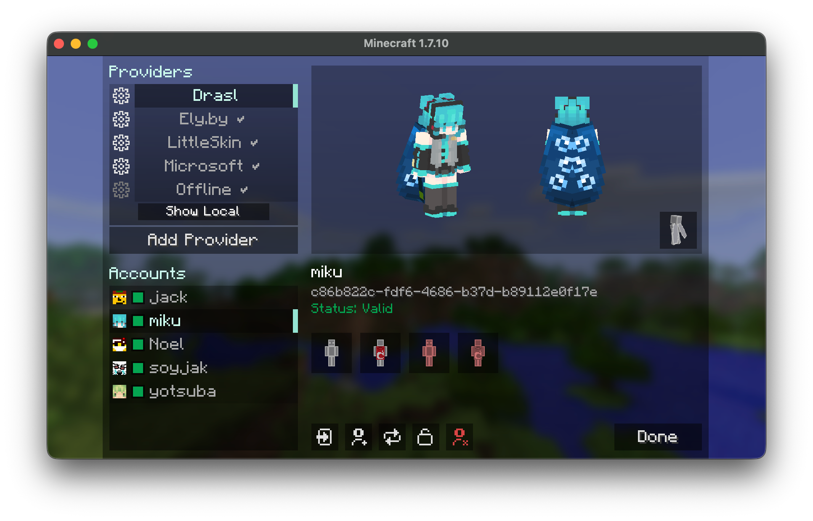

# Wawel Auth


Authentication mod for Minecraft 1.7.10. Use Microsoft or any Yggdrasil-compatible provider, or run your own auth server alongside the game server. Includes modern and HD skins, animated capes, and optional 3D skin layers.

Some highlights of what **Wawel Auth** allows you to do:

* Login into any Yggdrasil-compatible provider on the client (Microsoft, [ely.by](https://ely.by/), [drasl](https://github.com/unmojang/drasl), ...)
* Bind accounts to servers
* Host an account and skin provider directly on the game server
* Allow any Yggdrasil-compatible provider to join your server
* Modern and HD skin support
* Animated capes for Wawel Auth accounts
* 3D skin layers implementation
* Admin web UI for server-side management

**Wawel Auth** does not need to be installed on the client, nor on the server to benefit from a lot of features.
You can setup a server that allows Microsoft and ely.by users, without clients having to do anything special.
Clients can also benefit from account management, modern skins, and 3d skin layers, even if a server doesn't run **Wawel Auth**.



[](https://github.com/JackOfNoneTrades/WawelAuth/releases)
[](https://maven.fentanylsolutions.org/#/releases/org/fentanylsolutions/wawelauth/WawelAuth)

[](https://discord.gg/xAWCqGrguG)

<!--[]()
[]()
[]()-->

## Dependencies

* [UniMixins](https://modrinth.com/mod/unimixins) [](https://www.curseforge.com/minecraft/mc-mods/unimixins) [](https://modrinth.com/mod/unimixins/versions) [](https://github.com/LegacyModdingMC/UniMixins/releases)
* [FentLib](https://github.com/JackOfNoneTrades/FentLib) [](https://github.com/JackOfNoneTrades/FentLib)
* [ModularUI2](https://github.com/GTNewHorizons/ModularUI2) [](https://github.com/GTNewHorizons/ModularUI2) (Client only)

## Client Setup And Use

**Wawel Auth** stores a small Minecraft instance-bound config file under `config/wawelauth/local.json`.
Most other settings, however, are shared across all Minecraft instances (can be disabled using `useOsConfigDir`).
Those settings live in files stored under the following locations:
* Windows: `%APPDATA%/wawelauth/`
* macOS: `~/Library/Application Support/wawelauth/`
* Linux: `$XDG_DATA_HOME/wawelauth/` or `~/.local/share/wawelauth/`

The main menu is opened with the `Auth` button in the multiplayer screen.
From there, you can add auth providers, and accounts.

Some things of note:
* Microsoft is built in.
* Any Yggdrasil / authlib-injector provider can be added by URL.
* The `Manage Local Auth...` button is the quickest way to use local accounts on a Wawel Auth server.
* Adding the same local server manually as a normal provider is also supported.
* Skin management buttons can be suppressed per provider through `client.json`, in the case a provider does not provide these functions. This is purely cosmetic.
  The following options let you configure this:
  * `disableSkinUpload`
  * `disableCapeUpload`
  * `disableTextureReset`

The `disable*` lists are regexes matched against provider name or API root.

* Animated capes are only supported by Wawel Auth servers, and are in the `minecraftcapes.net` format.

> [!NOTE]
> You can also drag and drop skins and capes, if using Java 17+.

## Server Setup And Use

### Files and locations

* Dedicated servers always use `config/wawelauth/` to store their config, and state data
* That state directory contains the SQLite database, generated keys, and stored textures

> [!WARNING]
> * Your private server key is sensitive information, never share it.
> * It is important to not change your server keys, if not absolutely necessary. Wawel Auth client users will need to trust the key again, and authlib-injector users will refuse to connect to a server whose public key has changed.

### Example local-only setup

`server.json`
```json
{
  "wawelAuthEnabled": true,
  "serverName": "My WawelAuth Server",
  "publicBaseUrl": "auth.example.com:25565",
  "apiRoot": "auth",
  "admin": {
    "enabled": true,
    "token": "strong_password_best_if_randomly_generated"
  }
}
```

1. set `online-mode=true` in `server.properties`
2. set `publicBaseUrl` to the real public base URL clients use
3. leave `apiRoot` as a relative path such as `auth`
4. set an admin token through `server.admin.token` or `WAWELAUTH_ADMIN_TOKEN`
5. restart the server

Notes:

* if `publicBaseUrl` has no scheme, Wawel Auth assumes `http://`
* with the example above, the auth API is published at `http://auth.example.com:25565/auth`
* on dedicated servers, Wawel Auth now hard-stops before world load if `online-mode=false`, `publicBaseUrl` is missing, or `apiRoot` is configured as a full URL
* for CI smoke tests only, `WAWELAUTH_CI=true` or `GITHUB_ACTIONS=true` bypasses the missing-`publicBaseUrl` hard stop

### Important server settings

* `registration.policy`: `OPEN`, `INVITE_ONLY`, `CLOSED`
* `textures`: max skin / cape dimensions, file limits, animated cape limits
* `http`: HTTP read timeout and max request body size
* `admin`: web UI enable flag, login token, session TTL

### Admin web UI

If `server.admin.enabled=true`, the admin UI is available at:

* `http://your-host:your-port/admin`

It manages users, textures, invites, whitelist, ops, `server.json`, and `server.properties`.

### Fallback providers

Fallback providers are defined in `fallback-servers.json` and checked in order.

```json
{
  "fallbackServers": [
    ...
  ]
}
```

> [!WARNING]
> `name` must not contain whitespaces.

> [!TIP]
> `name` is used in provider-scoped commands such as `/op player@provider`.

#### Microsoft fallback example

```json
{
  "name": "mojang",
  "sessionServerUrl": "https://sessionserver.mojang.com",
  "accountUrl": "https://authserver.mojang.com",
  "servicesUrl": "https://api.minecraftservices.com",
  "skinDomains": [
    ".minecraft.net",
    ".mojang.com"
  ],
  "cacheTtlSeconds": 300
}
```

#### Ely.by fallback example

```json
{
  "name": "ely.by",
  "sessionServerUrl": "https://authserver.ely.by/api/authlib-injector/sessionserver",
  "accountUrl": "https://authserver.ely.by/api",
  "servicesUrl": "https://authserver.ely.by/api/authlib-injector/minecraftservices",
  "skinDomains": [
    "ely.by",
    ".ely.by"
  ],
  "cacheTtlSeconds": 300
}
```

## Commands

### `/wawelauth`

* `/wawelauth register <username> <password>`
* `/wawelauth invite create [uses|unlimited]`
* `/wawelauth invite list`
* `/wawelauth invite delete <code>`
* `/wawelauth invite purge`
* `/wawelauth test`

### Provider-qualified whitelist and op commands

* `/whitelist add <username>@<provider>`
* `/whitelist remove <username>@<provider>`
* `/op <username>@<provider>`
* `/deop <username>@<provider>`

`<provider>` is either a `fallbackServers[].name` or one of the local aliases: `local`, `localauth`, `wawelauth`, `self`.

Regular whitelist and op commands are disabled.


> [!WARNING]
> Plain authlib-injector clients (or vanilla) can authenticate against a Wawel Auth server, but mixed-provider skin handling only works if the client and server run Wawel Auth.

## Interoperability Notes


## Building

```bash
./gradlew build
```

## Credits

* Skin layer implementation inspired by [last MIT commit](https://github.com/tr7zw/3d-Skin-Layers/commit/1830e6ed7b86550afc2ed2695391a09ca70285e2) of [3D Skin Layers Mod](https://github.com/tr7zw/3d-Skin-Layers)
* [Catalogue-Vintage](https://github.com/RuiXuqi/Catalogue-Vintage) for folder icon and system-open inspiration
* [GT:NH buildscript](https://github.com/GTNewHorizons/ExampleMod1.7.10)
* [Background image](https://www.pinterest.com/pin/367536019569661725/)

## License

`LGPLv3 + SNEED`

## Buy me some creatine

* [ko-fi.com](https://ko-fi.com/jackisasubtlejoke)
* Monero: `893tQ56jWt7czBsqAGPq8J5BDnYVCg2tvKpvwTcMY1LS79iDabopdxoUzNLEZtRTH4ewAcKLJ4DM4V41fvrJGHgeKArxwmJ`

<br>


