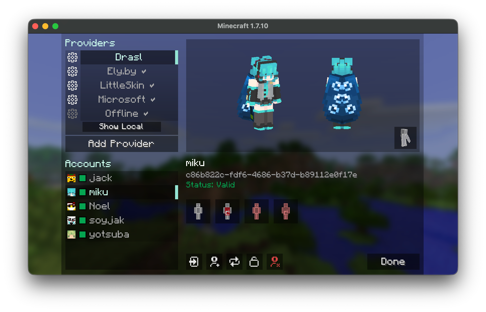

# Wawel Auth


Authentication mod for *Minecraft* 1.7.10.

**Server**: Allow players from *Microsoft*, *Ely.by*, *LittleSkin*, and more, including the option to host your own integrated auth server.

**Client**: Login into and manage accounts for various auth providers and servers. Also includes cosmetic features like modern skin support, or 3D skin layers.

This mod also adds some other features, like an admin web panel, and animated capes (only for *Wawel Auth* accounts). For a complete list of features, and usage instructions, consult [the wiki](https://github.com/JackOfNoneTrades/WawelAuth/wiki).

*Wawel Auth* can be installed on the server, client, or both, but the last combination is recommended for an optimal experience. By default, the client saves configuration to a shared folder, no need to login again to all your accounts when switching *Minecraft* instances. This can be disabled.



[](https://github.com/JackOfNoneTrades/WawelAuth/releases)
[](https://www.curseforge.com/minecraft/mc-mods/wawel-auth)
[](https://modrinth.com/mod/wawel-auth)
[](https://67.fentanylsolutions.org/mod/wawel-auth)
[](https://maven.fentanylsolutions.org/#/releases/org/fentanylsolutions/wawelauth/WawelAuth)

[](https://discord.gg/xAWCqGrguG)
[](https://www.mcmod.cn/class/27750.html#comment-2159044)

## Dependencies

* [UniMixins](https://modrinth.com/mod/unimixins) [](https://www.curseforge.com/minecraft/mc-mods/unimixins) [](https://modrinth.com/mod/unimixins/versions) [](https://github.com/LegacyModdingMC/UniMixins/releases)
* [FentLib](https://www.curseforge.com/minecraft/mc-mods/fentlib) [](https://www.curseforge.com/minecraft/mc-mods/fentlib) [](https://modrinth.com/mod/fentlib) [](https://67.fentanylsolutions.org/mod/fentlib) [](https://github.com/JackOfNoneTrades/FentLib)
* [ModularUI2](https://github.com/GTNewHorizons/ModularUI2) [](https://www.curseforge.com/minecraft/mc-mods/modularui)  [](https://modrinth.com/mod/modularui) [](https://github.com/GTNewHorizons/ModularUI2) (Client only)

> [!NOTE]
> Each release also includes a `nodep` jar. It does not ship `sqlite-jdbc` or Bouncy Castle, and relies on [FalsePatternLib](https://github.com/FalsePattern/FalsePatternLib) [](https://www.curseforge.com/minecraft/mc-mods/fplib) [](https://modrinth.com/mod/fplib) [](https://github.com/FalsePattern/FalsePatternLib) to supply them.

> [!NOTE]
> `wawelauth-curseforge` releases do not have the ability to import launcher sessions.

## Building

```bash
./gradlew build
```

## Credits

* Skin layer implementation inspired by the [last MIT commit](https://github.com/tr7zw/3d-Skin-Layers/commit/1830e6ed7b86550afc2ed2695391a09ca70285e2) of [3D Skin Layers Mod](https://github.com/tr7zw/3d-Skin-Layers)
* [Catalogue-Vintage](https://github.com/RuiXuqi/Catalogue-Vintage) for folder icon and system-open inspiration
* [GT:NH buildscript](https://github.com/GTNewHorizons/ExampleMod1.7.10)
* [Background image](https://www.pinterest.com/pin/367536019569661725/)

## License

`LGPLv3`

## Buy me some creatine

* [ko-fi.com](https://ko-fi.com/jackisasubtlejoke)
* Monero: `893tQ56jWt7czBsqAGPq8J5BDnYVCg2tvKpvwTcMY1LS79iDabopdxoUzNLEZtRTH4ewAcKLJ4DM4V41fvrJGHgeKArxwmJ`

<br>


